# Step 3 — Create a Dataset

This guide walks you through capturing marble images and labeling them for training.

> **Machine:** Raspberry Pi

## 3.1 Capture images

Put only **one color** of marbles in the sorter at a time. Aim for at least **200 images per color**.

```bash
sudo .venv-3.10/bin/python create_unlabeled_dataset.py
```

This saves images to `dataset/out/`. Rename the folder to the marble color:

```bash
mv dataset/out dataset/red
mkdir -p dataset/out
```

To lift the elevator motor so you can swap marbles more easily:

```bash
sudo .venv-3.10/bin/python actuator/elevator_motor.py
```

Repeat for every color. You should end up with a folder structure like this:

```
dataset/
├── black/
│   ├── frame_0000.png
│   ├── frame_0001.png
│   └── ...
├── orange/
│   ├── frame_0000.png
│   └── ...
├── green/
│   └── ...
├── red/
│   └── ...
└── ...
```

## 3.2 Auto-label the images

This script uses OpenCV to detect marbles and generate bounding-box labels automatically. It will not detect the color of the marbles. Instead it will take the folder name as the color label. The results are saved as `dataset-<color>.json` files inside the `dataset/` folder.

```bash
sudo .venv-3.10/bin/python label_dataset.py
```

Result should look like this:
```
dataset/
├── black
├── green
├── mixed-not-labeled
├── orange
├── red
├── white
├── dataset-black.json
├── dataset-green.json
├── dataset-orange.json
├── dataset-red.json
└── dataset-white.json
```

> The auto-labeler is not perfect — you **must** review and correct the labels in the next step.

## 3.3 Review labels with Label Studio

### Start Label Studio

```bash
curl -sSL https://get.docker.com | sudo sh
```

```bash
mkdir -p label-studio
sudo chown :0 label-studio
sudo docker run --network host \
  -v $(pwd)/label-studio:/label-studio/data \
  --name label-studio -d heartexlabs/label-studio:latest

echo "Label Studio is starting up. Please wait a moment (1min)..."
sleep 60
echo "Label Studio should now be running at http://localhost:8080 (oder über die IP-Adresse des Hosts)"
```

Open <http://localhost:8080> in your browser.

### Serve images locally

Label Studio needs HTTP access to the images. Start the included server on port 1000:

```bash
sudo python3 http-server.py
```

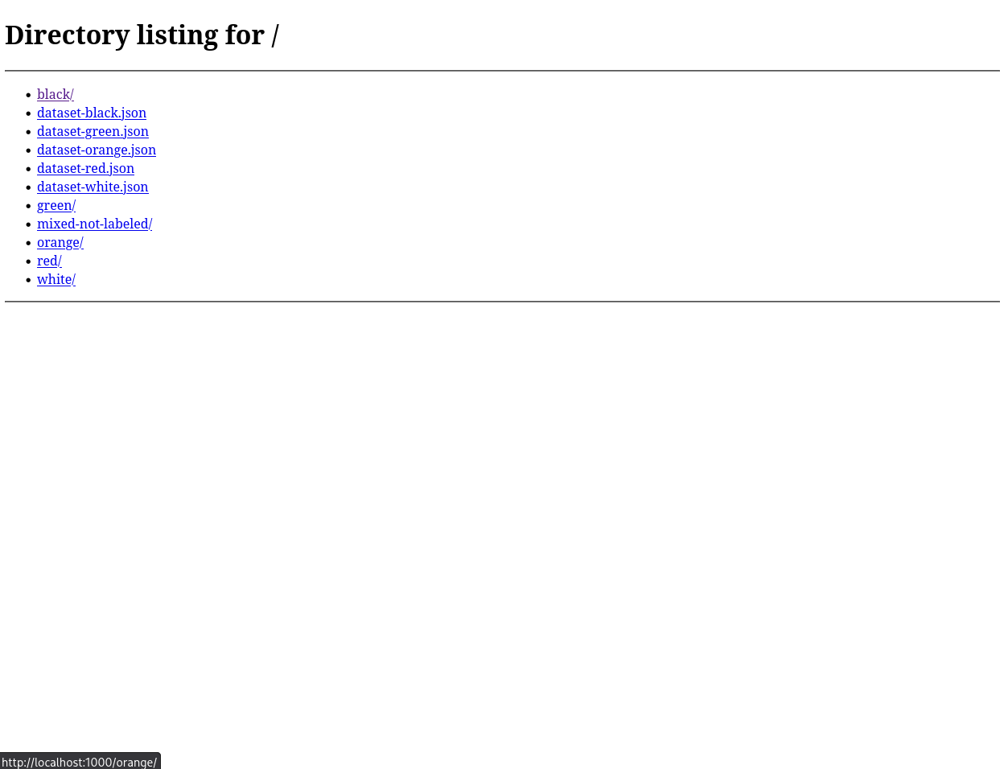

### Import and review

1. Click **Import** in Label Studio.
2. Upload the `dataset-<color>.json` files from the `dataset/` folder.
3. Review each image and correct any wrong bounding boxes.

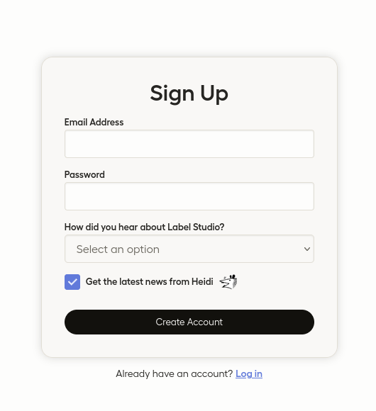
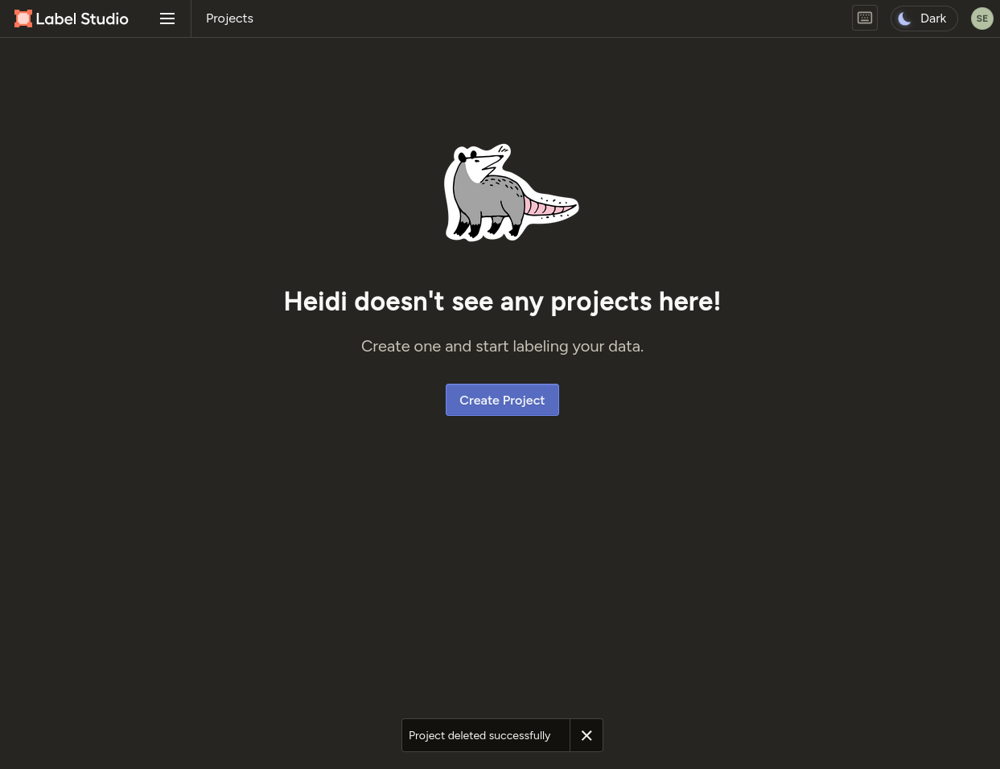
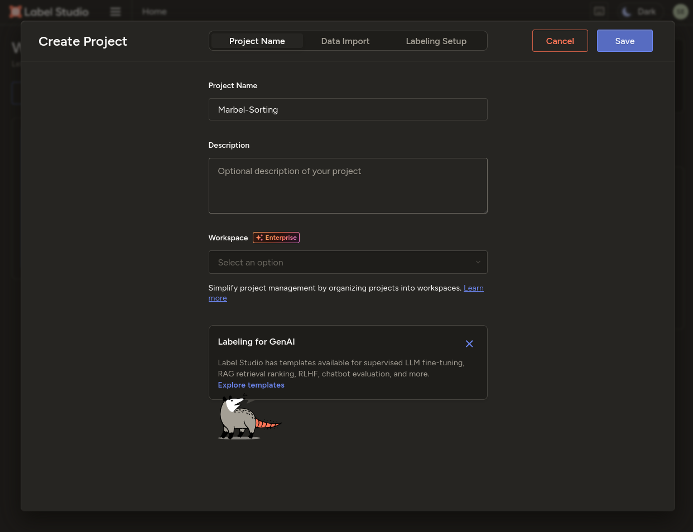
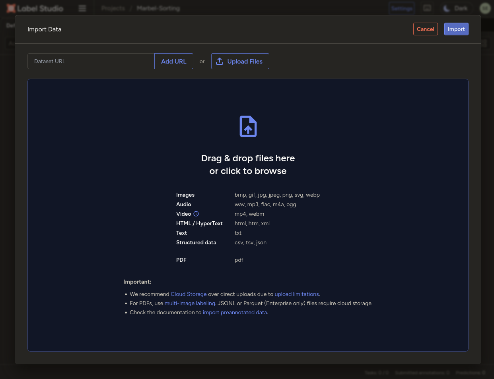
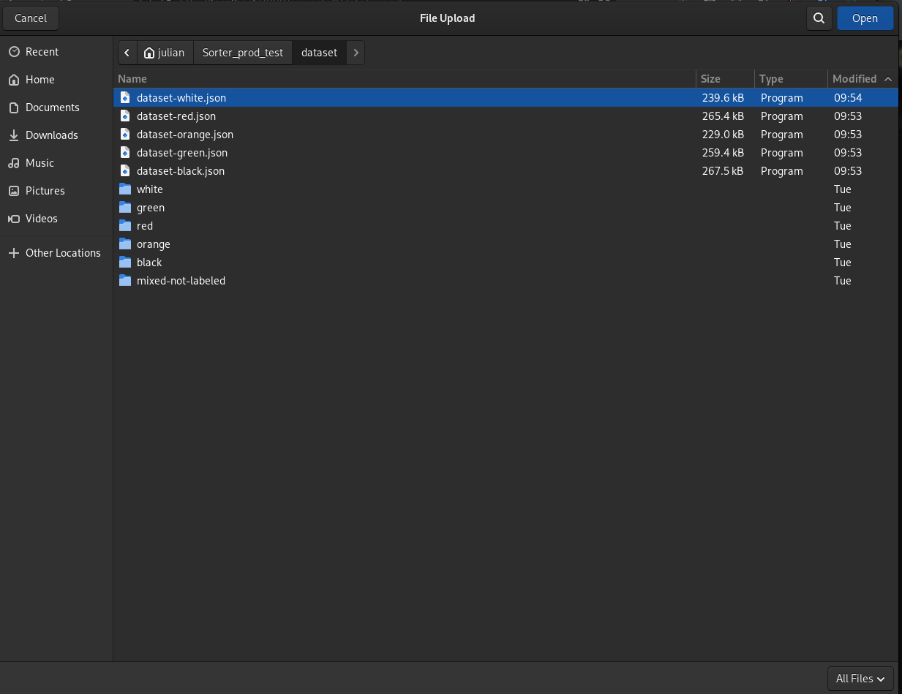
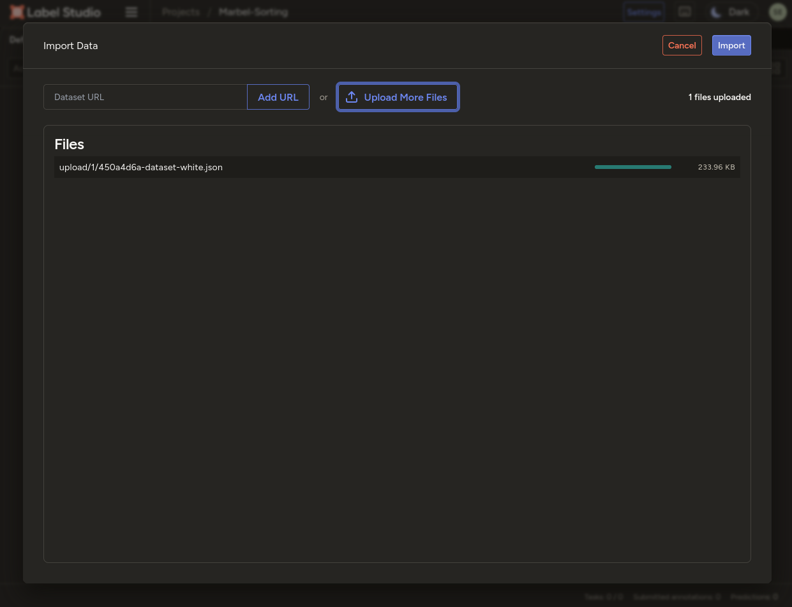
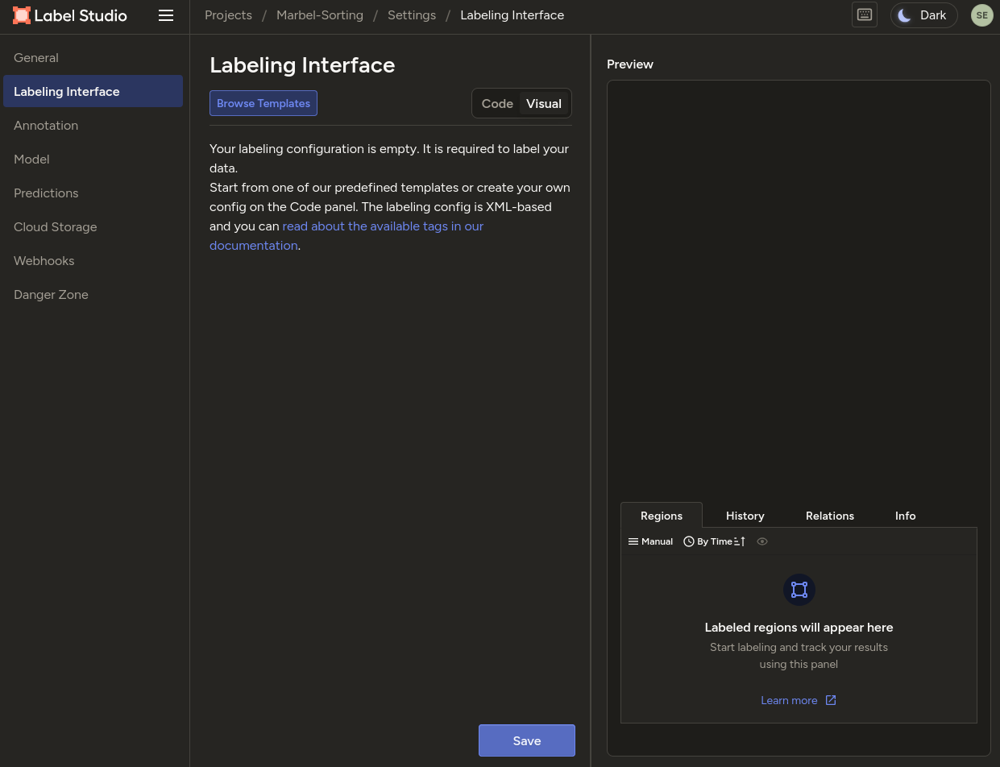
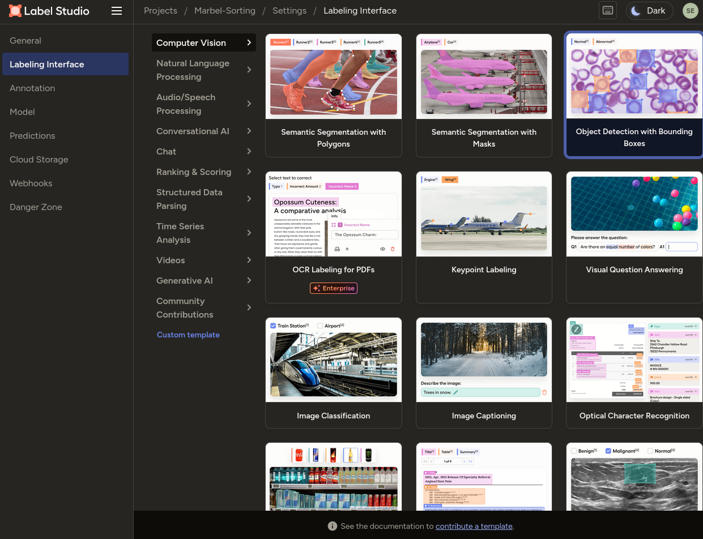
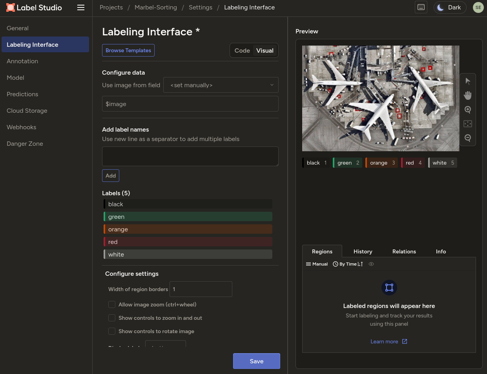
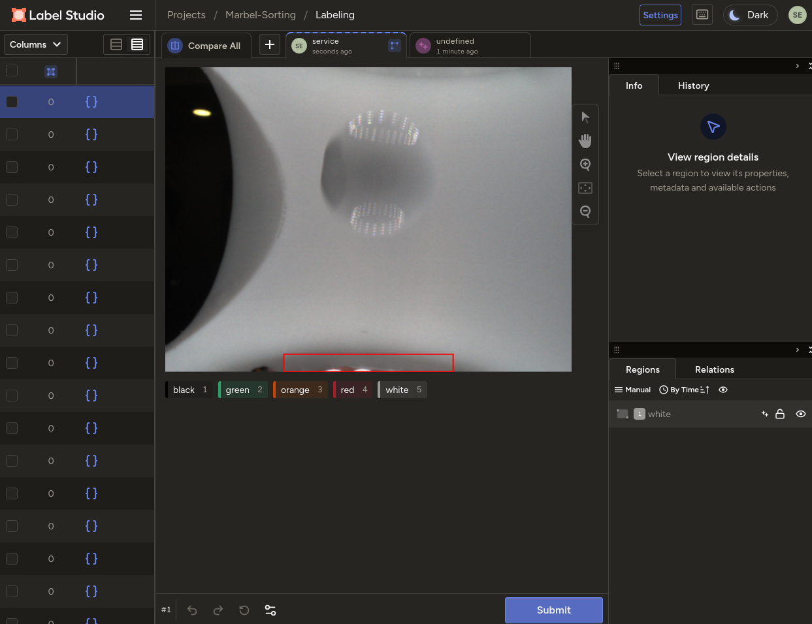
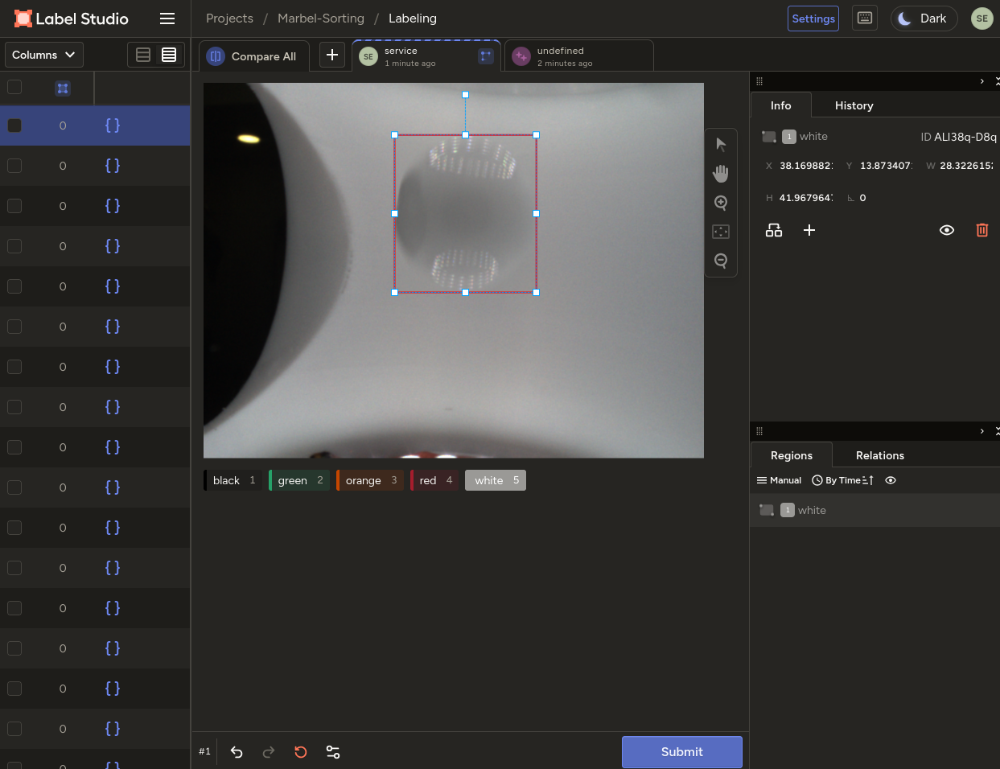
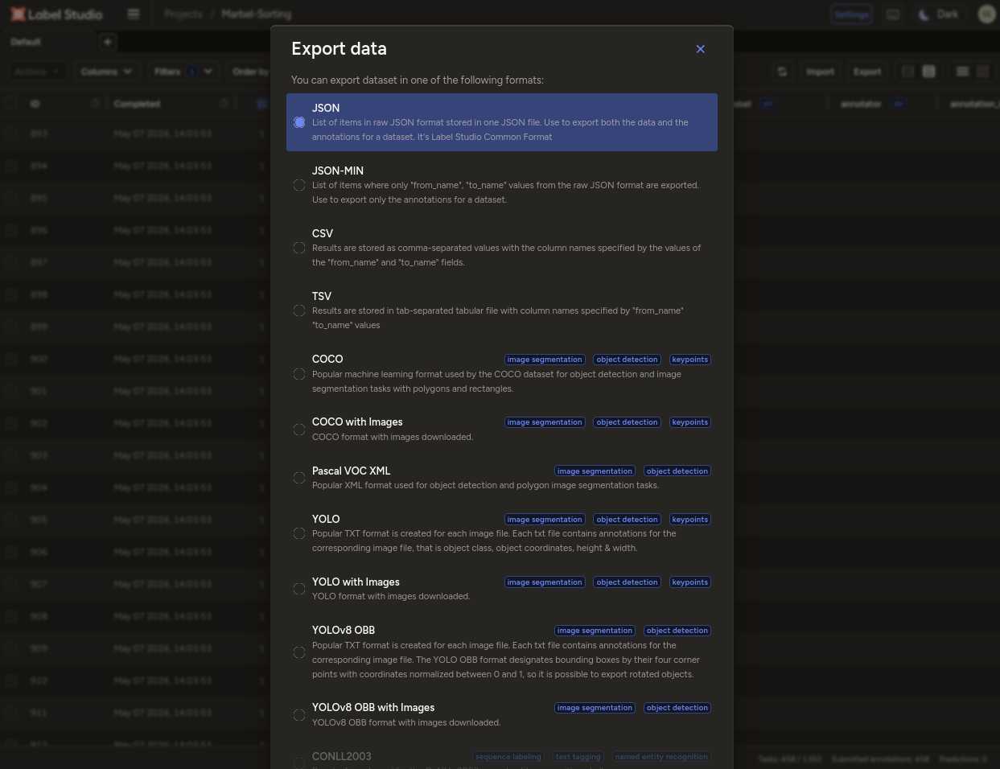

Once you are happy with the labels, you are ready to train the model.

---

**Previous:** [Step 2 — Training PC Setup](02-training-pc-setup.md)
**Next:** [Step 4 — Train the Model](04-train-model.md)

[**Home**](../README.md)